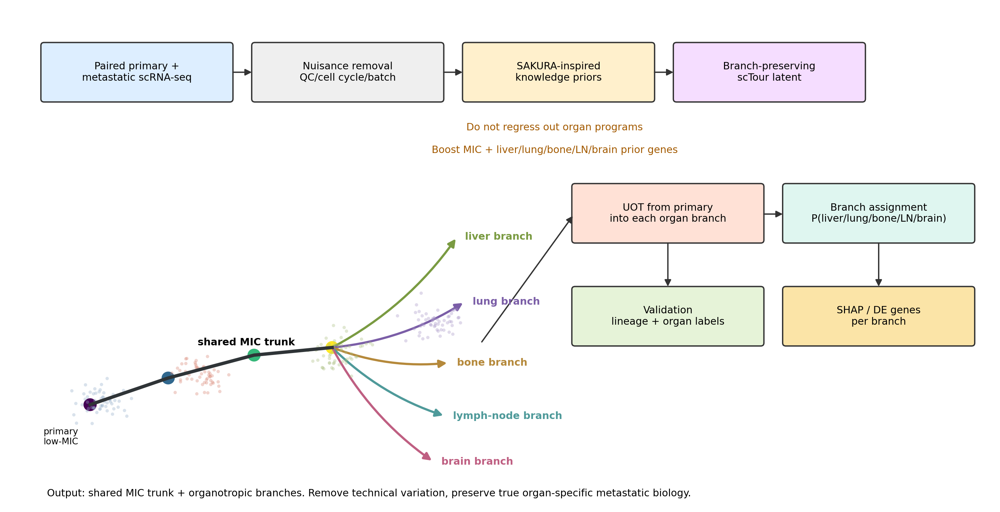
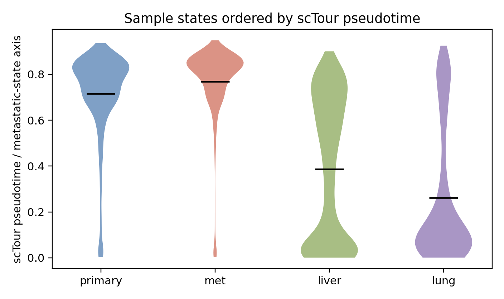
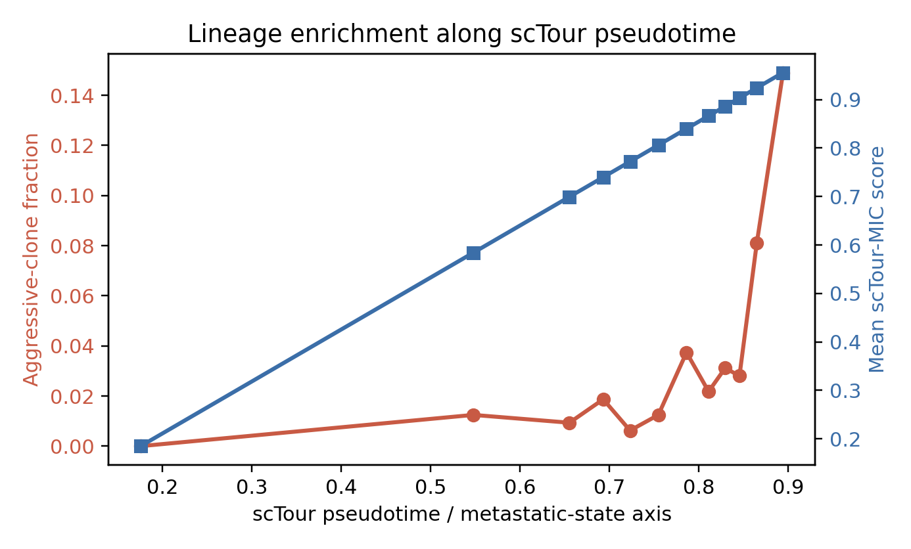
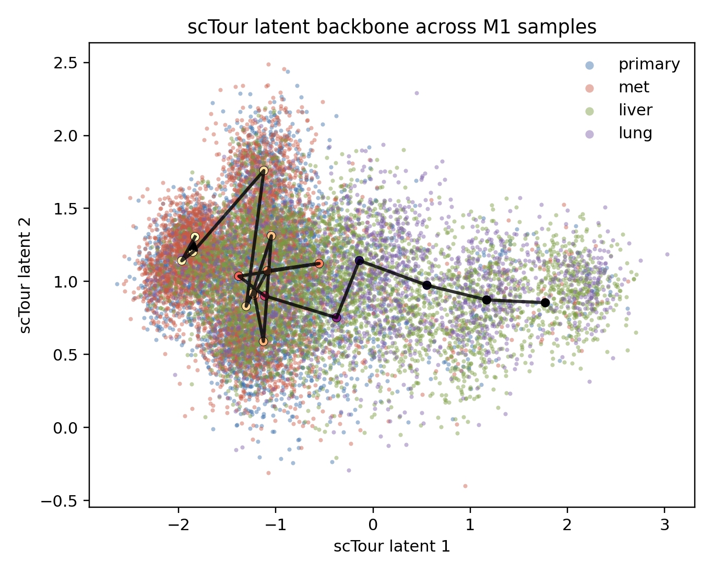
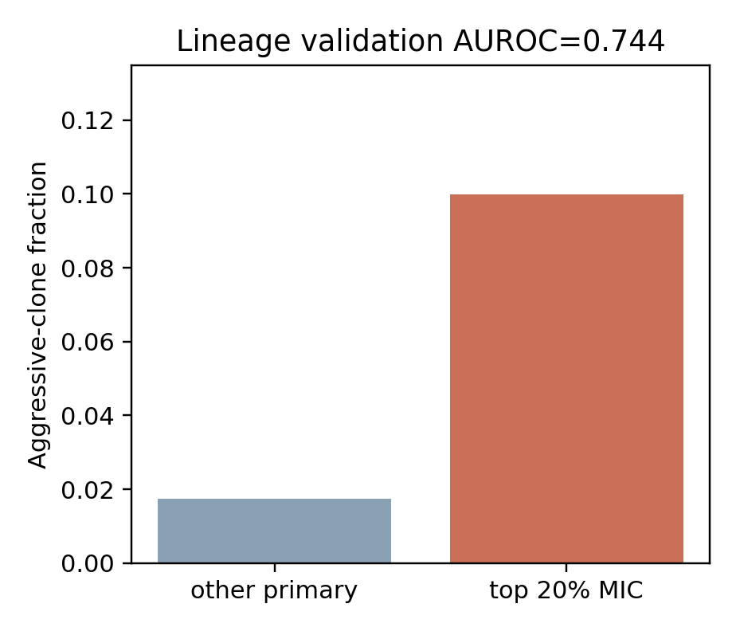
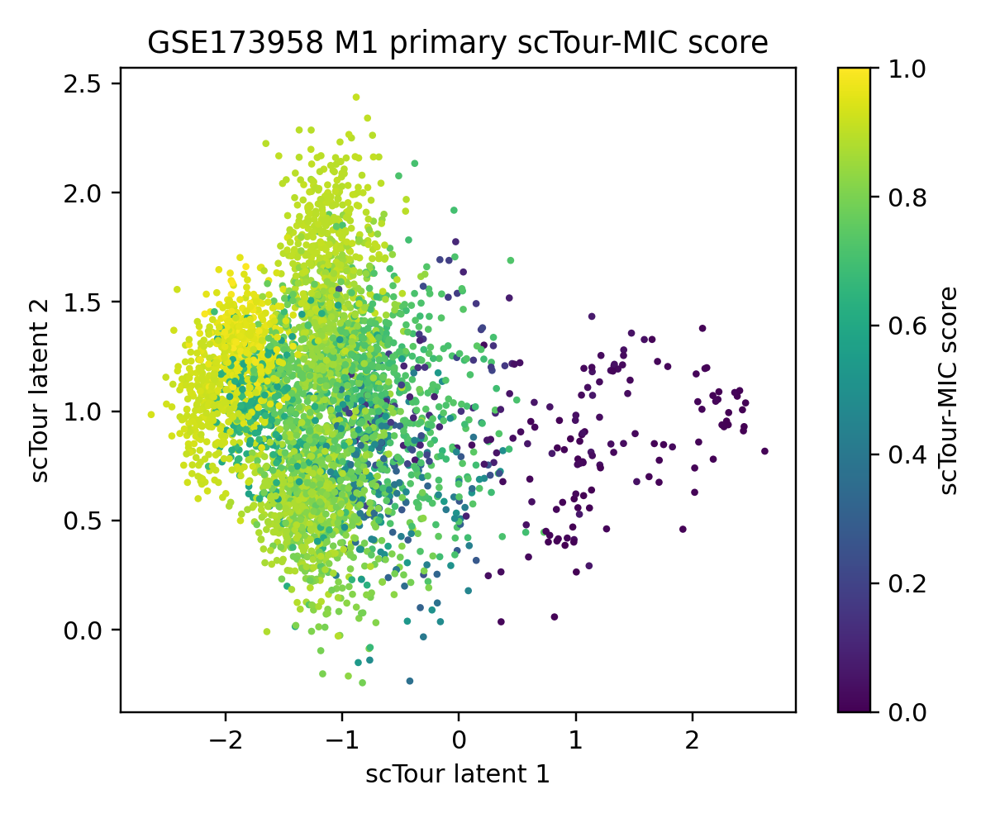
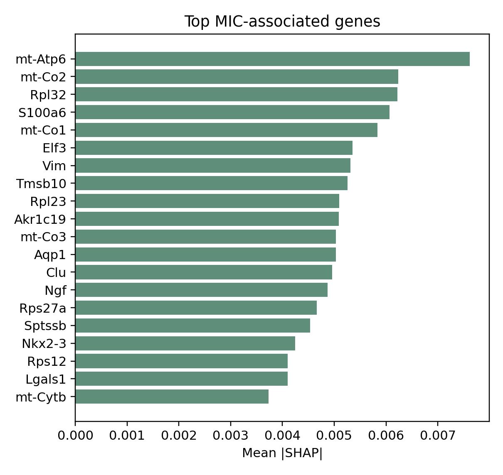

# MOT-MIC

[](https://github.com/yuhan1li/scMIC/actions/workflows/docs.yml)



scMIC is a computational framework for discovering metastasis-initiating
cells from paired primary and metastatic single-cell transcriptomes.

It uses a SAKURA-inspired, knowledge-guided strategy to preserve rare
organotropic signals while removing technical nuisance variation. scTour learns
the shared MIC trunk, and unbalanced optimal transport maps primary tumor cells
into organ-specific metastatic branches.

MOT-MIC is designed for method development and validation on public metastasis
datasets, including lineage-traced, time-course, paired human, spatial, and
bulk survival cohorts.

<br clear="left"/>

## Key features

- Branch-preserving scTour MIC scoring from paired primary and metastatic
  scRNA-seq data.
- SAKURA-inspired organ priors for liver, lung, bone, lymph-node, and brain
  metastatic branches.
- Nuisance residualization for QC, library size, mitochondrial fraction,
  cell-cycle, and technical batch effects while preserving organ programs.
- Unbalanced optimal transport with sparse top-k origin filtering for
  interpretable primary-to-metastasis organotropic mapping.
- Organotropic MIC scores for liver, lung, bone, brain, or user-defined
  metastatic sites.
- Lineage-aware validation workflow using `GSE173958`, the strongest available
  public benchmark for metastatic clone aggression.
- scTour-style tutorial notebooks for each public metastasis dataset.
- SHAP-based gene prioritization for pan-MIC and organ-specific metastatic
  programs.
- Spatial and bulk-cohort validation templates for MIC signature transfer.

## Installation

Clone the repository and install the required Python packages:

```console
git clone https://github.com/yuhan1li/scMIC.git
cd scMIC
pip install -r requirements.txt
pip install -r requirements-analysis.txt
```

Regenerate the algorithm schematic:

```console
python scripts/make_diagram.py
```

## Branch-Preserving Upgrade

The upgraded framework explicitly separates three sources of variation:

```text
Z_total = Z_shared_MIC_trunk + Z_organ_branch + Z_nuisance
```

Only `Z_nuisance` is removed. Organ programs are not regressed out. Instead,
compact liver/lung/bone/lymph-node/brain prior gene sets are upweighted so rare
organotropic signals can survive dimensionality reduction. This follows the
SAKURA idea of using knowledge-derived genes to guide dimensionality reduction
and recover important rare or subtle signals.

```python
from motmic import BranchPreservingEmbedder, assign_organ_branch

embedder = BranchPreservingEmbedder(prior_weight=3.0, n_components=20)
branch_result = embedder.fit_transform(primary_and_metastasis_expr, nuisance_covariates=qc_table)

organ_program_scores = branch_result.organ_scores
branch_embedding = branch_result.embedding
predicted_branch = assign_organ_branch(ot_site_scores)
```

## Basic usage

```python
from pathlib import Path

from motmic import find_10x_triplet, read_10x_mtx

raw_dir = Path("data/raw/GSE173958")
primary_files = find_10x_triplet(raw_dir, sample_token="M1-PT")
liver_files = find_10x_triplet(raw_dir, sample_token="M1-Liver")
lung_files = find_10x_triplet(raw_dir, sample_token="M1-Lung")

primary = read_10x_mtx(*primary_files)
liver = read_10x_mtx(*liver_files)
lung = read_10x_mtx(*lung_files)
```

Run the validated GSE173958 M1 workflow on a server:

```console
python scripts/run_gse173958_sctour_validation.py \
  --raw-dir data/raw/GSE173958 \
  --max-cells-per-sample 4000 \
  --epochs 30
```

## GSE173958 Validation Result

The current repository includes a real M1 lineage-validation run. The workflow
uses M1 primary tumor, M1-Met, M1-Liver, and M1-Lung from `GSE173958`, parses
macsGESTALT clone labels from the `*.stats.txt.gz` files, and validates predicted
primary MICs against the dominant metastatic lineage group.

| Metric | Value |
|---|---:|
| Primary cells analyzed | 3,854 |
| Lineage-labeled primary cells | 2,811 |
| Aggressive-lineage primary cells | 131 |
| scTour-MIC AUROC | 0.744 |
| scTour-MIC AUPRC | 0.117 |
| Top-20% MIC enrichment OR | 4.96 |
| Fisher P value | 2.74e-18 |
| OT transport-mass AUROC | 0.448 |

`OT transport-mass AUROC = 0.448` means that raw OT mass alone does not recover
the aggressive lineage in this dataset. We therefore treat OT mass as an
organotropic mapping signal, not as the main MIC score. The main validated MIC
score is `sctour_MIC_score`, which follows the scTour metastatic-state axis.









The 2D scTour latent scatter below is kept as an auxiliary diagnostic, but it
should not be interpreted as the primary progression trajectory.





## Tutorials

The tutorials follow the same teaching rhythm as the scTour basic inference
notebooks:

```text
Dataset -> Data loading -> Model training -> Inference -> Visualization -> Validation -> Robustness
```

| Notebook | Dataset | Analysis shown |
|---|---|---|
| [GSE173958 lineage validation](https://scmic.readthedocs.io/en/latest/notebook/02_GSE173958_lineage_validation.html) | GSE173958 | Primary-to-liver/lung/macrometastasis inference with lineage validation plan |
| [GSE249057 time-course discovery](https://scmic.readthedocs.io/en/latest/notebook/03_GSE249057_timecourse_discovery.html) | GSE249057 | 0h parental tumor to 6h/2mo/4mo metastatic-state discovery |
| [GSE178318 human CRC liver validation](https://scmic.readthedocs.io/en/latest/notebook/04_GSE178318_human_crc_liver_metastasis.html) | GSE178318 | Human CRC primary-to-liver validation and patient-level aggregation |
| [GSE277783 spatial validation](https://scmic.readthedocs.io/en/latest/notebook/05_GSE277783_spatial_validation.html) | GSE277783 | Spatial validation of MOT-MIC-derived MIC gene programs |

## Recommended datasets

| Dataset | Role | Gold-standard level | Notes |
|---|---|---:|---|
| `GSE173958` | Main validation | Strongest | scRNA-seq plus CRISPR lineage tracing in metastatic PDAC; aggressive clones provide the closest cell-level ground truth. |
| `GSE249057` / `GSE249058` | Discovery/training | Weak | Multi-timepoint ESCC lung metastasis model; useful for learning early-to-late metastatic state transitions. |
| `GSE178318` | Human paired validation | Weak clinical | Matched primary CRC and liver metastasis scRNA-seq; validate MIC burden against liver metastatic burden. |
| `GSE277783` | Spatial validation | Weak spatial | PDAC spatial data; validate MIC/spots in spatial niches and treatment-associated regions. |
| `OMIX002487` | External human validation | Weak clinical | Human PDAC scRNA-seq used in the scMIC manuscript. |
| TCGA | Bulk survival validation | Cohort-level only | Test whether derived MIC signatures predict OS/DFS. |

Inspect available GEO files without downloading large matrices:

```console
python scripts/download_geo.py --dry-run --from-filelist --gse GSE173958 GSE249057
```

## Documentation

- Algorithm details: `ALGORITHM.md`
- Dataset plan: `DATASETS.md`
- Notebook index: `notebooks/README.md`
- Sphinx-style documentation skeleton: `docs/source/index.rst`
- Online documentation: https://scmic.readthedocs.io/en/latest/

## Method summary

For each metastatic site `k`, scMIC estimates a transport plan from primary
tumor cells to metastatic tumor cells in scTour latent space:

```text
T_k = UOT(primary_cells, metastatic_cells_k)
```

Sparse top-k filtering is applied to each metastatic cell column, and each
primary cell receives:

```text
site_MIC_score_i,k = sum_j T_filtered_k(i,j)
transport_pan_score_i = sum_k site_MIC_score_i,k
organ_specificity_i = max_k(site_MIC_score_i,k) / transport_pan_score_i
sctour_MIC_score_i = minmax(scTour_time_i)
```

Candidate metastatic genes are prioritized with SHAP and then cross-checked by
MIC/non-MIC differential expression, lineage enrichment, cross-dataset
reproducibility, and survival association.

## Reference datasets and literature

MOT-MIC is motivated by recent work on scMIC, macsGESTALT lineage tracing,
MetaNet organotropic risk modeling, SIDISH clinical single-cell integration, and
single-cell trajectory/transport methods including scTour and optimal transport
models. The branch-preserving upgrade is inspired by SAKURA, a
knowledge-guided strategy for preserving important rare or subtle single-cell
signals during dimensionality reduction:
https://pmc.ncbi.nlm.nih.gov/articles/PMC12964657/
