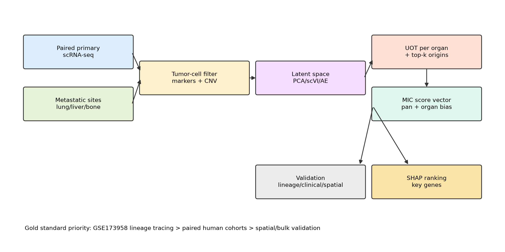

MOT-MIC: multi-organ optimal transport for metastasis-initiating cell discovery
================================================================================

scMIC is a computational framework for discovering metastasis-initiating
cells from paired primary and metastatic single-cell transcriptomes.

It provides a unified workflow for scoring primary tumor cells with a scTour
metastatic-state axis, assigning organ-specific metastatic propensity with
unbalanced optimal transport, validating predictions against lineage and
clinical evidence, and ranking metastatic genes with SHAP-based interpretability.

.. raw:: html

    

Key features
------------

- scTour-based MIC scoring from paired primary and metastatic scRNA-seq data.
- Unbalanced optimal transport with sparse top-k origin filtering for
  organotropic mapping.
- Organotropic MIC scores for liver, lung, bone, brain, or user-defined sites.
- Lineage-aware validation with GSE173958.
- scTour-style tutorials for discovery, lineage validation, clinical validation,
  and spatial transfer.
- SHAP-based prioritization of pan-MIC and organ-specific metastatic genes.
- Completed GSE173958 M1 validation: scTour-MIC AUROC 0.744 and top-20%
  aggressive-lineage enrichment OR 4.96, Fisher P 2.74e-18.
- Trajectory views prioritize scTour pseudotime distributions and lineage
  enrichment along pseudotime; 2D latent scatters are auxiliary diagnostics.

Installation
------------

MOT-MIC requires Python 3.8 or later::

    git clone https://github.com/yuhan1li/scMIC.git
    cd scMIC
    pip install -r requirements.txt
    pip install -r requirements-analysis.txt

Regenerate the algorithm schematic::

    python scripts/make_diagram.py

Run the validated GSE173958 M1 workflow::

    python scripts/run_gse173958_sctour_validation.py \
        --raw-dir data/raw/GSE173958 \
        --max-cells-per-sample 4000 \
        --epochs 30

Tutorials
---------

.. toctree::
   :maxdepth: 2
   :caption: Tutorials
   :hidden:

   notebook/02_GSE173958_lineage_validation
   notebook/03_GSE249057_timecourse_discovery
   notebook/04_GSE178318_human_crc_liver_metastasis
   notebook/05_GSE277783_spatial_validation

API
---

.. toctree::
   :maxdepth: 2
   :caption: API
   :hidden:

   api_core
   api_io
   api_interpret
   api_validation

Reference datasets
------------------

The recommended validation hierarchy is GSE173958 lineage tracing, GSE249057
time-course discovery, GSE178318 paired human CRC liver metastasis, GSE277783
spatial validation, and TCGA bulk survival transfer.
